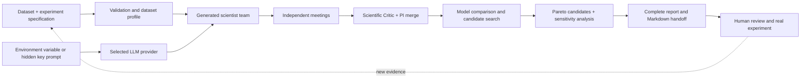
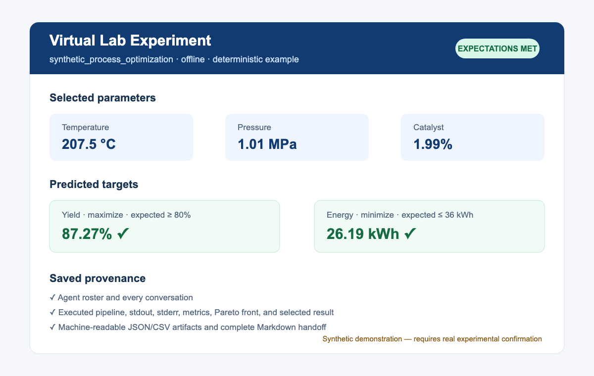

# Virtual Lab Experiment

[](https://github.com/HongYu-Wu-Andy/virtual-lab-experiment/actions/workflows/ci.yml)
[](LICENSE)
[](CHANGELOG.md)

Virtual Lab Experiment is a Codex plugin for reproducible, agent-led machine-learning experiments on numeric CSV or TSV datasets. Users choose the LLM provider and model that run the scientist team. The plugin conducts structured meetings, compares regression models, searches multi-objective candidates, and preserves every conversation, the executed code, terminal output, metrics, candidates, and final result.

> [!IMPORTANT]
> The selected parameters are a proposal for the next real experiment. Model predictions are not experimental validation, causal evidence, or a substitute for domain, safety, ethics, or regulatory review.

## Why use it?

- Bring your own numeric experimental dataset and optimization goals.
- Let a generated team of scientific agents critique the experiment and modeling plan.
- Choose OpenAI, DeepSeek, Anthropic, Google Gemini, or another compatible provider.
- Compare validated surrogate models and search a constrained multi-objective design space.
- Keep a reproducible record of the full discussion, generated code, execution, and results.
- Work without an API key in deterministic offline mode.

## How it works



API credentials are used only by the selected provider client. They are never placed in the experiment specification, prompts, generated code, conversations, execution metadata, or reports.

## What it does

1. Validates the dataset, features, targets, directions, bounds, and constraints.
2. Creates a Principal Investigator, Scientific Critic, domain scientist, experimental-design/statistics specialist, and machine-learning/optimization specialist.
3. Runs independent meetings and a critic-assisted merge.
4. Compares Random Forest, Extra Trees, Gradient Boosting, and scaled KNN for each target.
5. Uses holdout validation plus grouped or shuffled cross-validation.
6. Lets the agent discussion choose the multi-objective decision method when `decision_method` is `auto`; TOPSIS is not prescribed.
7. Searches feasible candidates, computes a Pareto front, and performs weight-sensitivity analysis.
8. Saves every agent message, the executed code, stdout and stderr, metrics, candidates, selected result, and a complete Markdown report.

## Supported scope

Version 0.2 supports numeric tabular regression in CSV and TSV files, with one or multiple targets and minimize, maximize, or target-value goals. Search stays inside observed or explicitly configured feature bounds.

It does **not** silently claim support for classification, images, categorical variables, spectra requiring preprocessing, censored outcomes, time-series forecasting, causal inference, or row-wise algebraic constraints.

## Install

Python 3.11 or newer is recommended.

Add this public repository as a Codex marketplace and install the plugin:

```bash
codex plugin marketplace add HongYu-Wu-Andy/virtual-lab-experiment --ref main
codex plugin add virtual-lab-experiment@virtual-lab-experiment
```

Install the Python runtime in an isolated environment:

```bash
python -m venv .venv
source .venv/bin/activate  # Windows: .venv\Scripts\activate
python -m pip install -e .
```

Restart Codex and begin a new task if the plugin does not appear immediately.

## Use in Codex

```text
Use $run-virtual-lab-experiment with my experiment.csv dataset.
The inputs are temperature, pressure, and catalyst concentration.
Maximize yield, minimize energy use, and save the full report to my chosen folder.
Use OpenAI with model YOUR_MODEL; I will supply the key securely.
```

Codex inspects the dataset first and asks only for scientifically material information that cannot be inferred safely, such as target direction, units, acceptance ranges, leakage groups, or physical constraints.

## Provider and credential setup

No API key is needed for deterministic offline mode. Live meetings support:

| Provider | `provider` value | Default key variable |
|---|---|---|
| OpenAI | `openai` | `OPENAI_API_KEY` |
| DeepSeek | `deepseek` | `DEEPSEEK_API_KEY` |
| Anthropic | `anthropic` | `ANTHROPIC_API_KEY` |
| Google Gemini | `google` | `GEMINI_API_KEY` |
| Other compatible provider | `openai_compatible` | `VIRTUAL_LAB_API_KEY` |

Set the appropriate environment variable:

```bash
export OPENAI_API_KEY="your-key"
```

Alternatively, enter it through a hidden runtime prompt:

```bash
virtual-lab-experiment \
  --spec examples/experiment_spec.json \
  --mode live \
  --provider openai \
  --model YOUR_MODEL \
  --prompt-api-key
```

`VIRTUAL_LAB_API_KEY` is a generic fallback. Never put a key in a JSON specification, command-line argument, chat message, tracked file, or issue. The runner records only the credential source label—not its value.

List the adapters with:

```bash
virtual-lab-experiment --list-providers
```

## Run the included example

```bash
virtual-lab-experiment \
  --spec examples/experiment_spec.json \
  --mode offline \
  --quick
```

An illustrative run selected approximately 207.5 °C, 1.01 MPa, and 1.99% catalyst, predicting 87.27% yield and 26.19 kWh. Both configured expectations were predicted to pass. These values demonstrate the software contract only; they come from synthetic data and are not scientific findings.



The timestamped run directory contains:

- `agents.json`
- `conversations.json` and `conversations.md`
- `dataset_profile.json` and the resolved `experiment_spec.json`
- `generated_pipeline.py`
- `execution.json` with stdout and stderr
- `results/metrics.csv`
- `results/pareto_front.csv`
- `results/selected_result.csv` and `results/results.json`
- `virtual_lab_report.md`

Use `--handoff-dir` or `handoff_directory` to copy the complete `.md` report into any chosen folder.

## Repository contents

- `.codex-plugin/plugin.json` — plugin identity and install metadata.
- `.agents/plugins/marketplace.json` — Codex marketplace entry.
- `skills/run-virtual-lab-experiment/SKILL.md` — workflow and scientific guardrails.
- `run_virtual_lab.py` — agent generation, meetings, orchestration, execution, and reporting.
- `pipeline_core.py` — dataset validation, model comparison, Pareto search, and final selection.
- `examples/` — synthetic dataset and runnable experiment specification.
- `tests/` — end-to-end, provider, packaging, and repository-hygiene tests.
- `.github/` — CI, dependency updates, and collaboration templates.
- `PRIVACY.md`, `SECURITY.md`, and `CONTRIBUTING.md` — public operating policies.
- `CITATION.cff` — software and research citation metadata.

## Verification

```bash
python -m unittest discover -s tests -v
python scripts/check_secrets.py
```

CI repeats the test suite on Python 3.11, 3.12, and 3.13 for every push and pull request.

## Privacy and security

Offline mode keeps dataset processing local. Live mode sends the experiment description, schema, summary statistics, correlations, meeting context, and result summaries to the chosen provider, but not raw dataset rows. See [PRIVACY.md](PRIVACY.md) for the complete data flow and [SECURITY.md](SECURITY.md) for reporting and safe-operation guidance.

## Roadmap

- Classification and categorical-feature support with explicit validation contracts.
- Time-series, spectral, and image-specific extension points.
- Prediction intervals and uncertainty-aware experimental acquisition.
- Pluggable optimizers and decision strategies selected through the meeting protocol.
- Connectors for materials databases, CALPHAD, laboratory systems, and process simulators.
- Repeated experiment cycles that incorporate measured results as new evidence.

Contributions should preserve the audit trail and scientific guardrails. See [CONTRIBUTING.md](CONTRIBUTING.md).

## Inspiration and attribution

The multi-agent research-meeting architecture is inspired by Swanson et al.'s Virtual Lab and its [MIT-licensed reference implementation](https://github.com/zou-group/virtual-lab). This repository is an independent implementation specialized for numeric experimental datasets; it is not affiliated with or endorsed by the original authors.

The initial additive-manufacturing use case was informed by Su et al.'s metallurgy-guided machine-learning alloy-design workflow. The generic plugin does not reproduce or redistribute either paper's proprietary experimental data.

- Swanson, K., Wu, W., Bulaong, N. L., Pak, J. E., & Zou, J. (2025). The Virtual Lab of AI agents designs new SARS-CoV-2 nanobodies. *Nature, 646*, 716–723. https://doi.org/10.1038/s41586-025-09442-9
- Su, J., Chen, L., Van Petegem, S., Jiang, F., Li, Q., Luan, J., Sing, S. L., Wang, J., & Tan, C. (2025). Additive manufacturing metallurgy guided machine learning design of versatile alloys. *Materials Today, 88*, 240–250. https://doi.org/10.1016/j.mattod.2025.06.031

## License

Released under the [MIT License](LICENSE).
